# Divyanshu Kashyap — Portfolio

Personal portfolio for **Divyanshu Kashyap**, a Frontend Engineer based in Jaipur.

**Live focus:** React.js · Next.js · TypeScript · motion (GSAP / Framer / Lenis) · Three.js accents · accessible UI.

Brand mark: `DIVYANSHU.DEV`

<p align="center">
  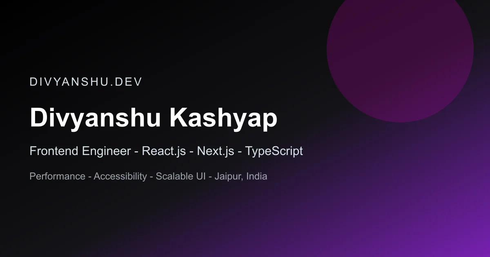
</p>

<p align="center">
  <a href="https://divyanshu.dev"><strong>Live site →</strong></a>
  ·
  <a href="https://github.com/Lucky-Kashyap">GitHub</a>
  ·
  <a href="https://www.linkedin.com/in/divyanshu-kashyap-b09138171/">LinkedIn</a>
</p>

---

## Website overview

Single-page marketing portfolio with:

| Section | Purpose |
| --- | --- |
| Hero | Name, roles, CTAs + AI avatar video (scroll-morphs into About) |
| About | Bio, stack, expertise, stats |
| Experience | Work & education timeline |
| Skills / Certs / Services | Capability bands |
| Projects | Featured + gallery of selected builds |
| FAQ / Contact | Hiring & collaboration |

Stack: **Next.js 16**, **React 19**, **Tailwind CSS v4**, GSAP ScrollTrigger, Framer Motion, Lenis, Three.js (R3F) for hero/projects atmosphere.

---

## Preview

### Hero & avatar

<p align="center">
  
  &nbsp;&nbsp;
  
</p>

Muted autoplay avatar video in Hero → About; tap to unmute for narration. Poster above is used for first paint and reduced-motion.

### Featured projects

<table>
  <tr>
    <td align="center" width="50%">
      <a href="https://github.com/Lucky-Kashyap/Front-End-Domination-Create-Anything-with-Code">
        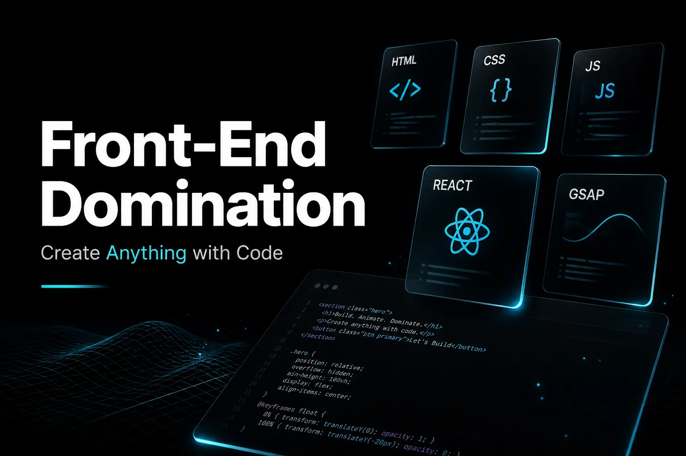
      </a>
      <br />
      <strong>Front-End Domination</strong><br />
      <sub>JS · React · GSAP · ScrollTrigger</sub>
    </td>
    <td align="center" width="50%">
      <a href="./public/projects/react-mysql-registration-form-fullstack.webp">
        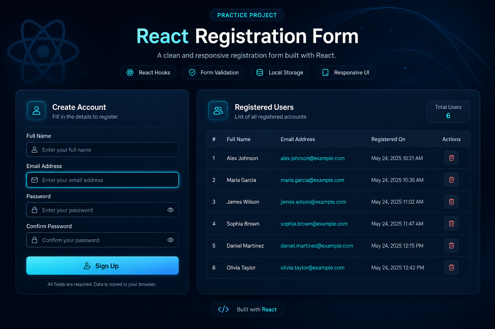
      </a>
      <br />
      <strong>React Registration Form</strong><br />
      <sub>React · Forms · CRUD UI</sub>
    </td>
  </tr>
  <tr>
    <td align="center" width="50%">
      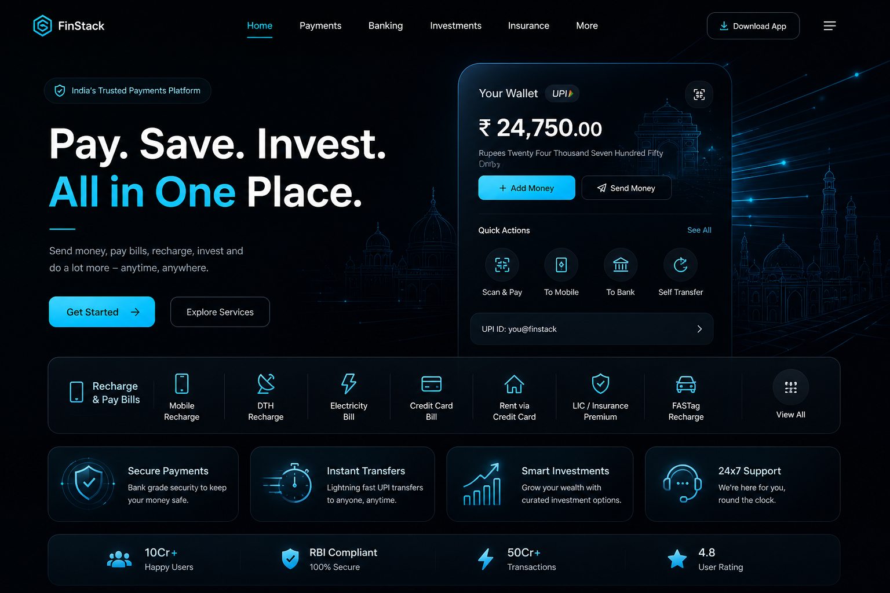
      <br />
      <strong>Paytm Clone</strong><br />
      <sub>Tailwind CSS · UI clone</sub>
    </td>
    <td align="center" width="50%">
      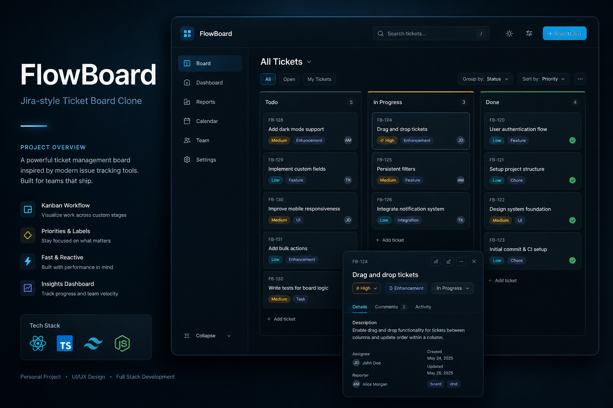
      <br />
      <strong>Jira Ticket Clone</strong><br />
      <sub>Vanilla JS · Ticket board</sub>
    </td>
  </tr>
  <tr>
    <td align="center" width="50%">
      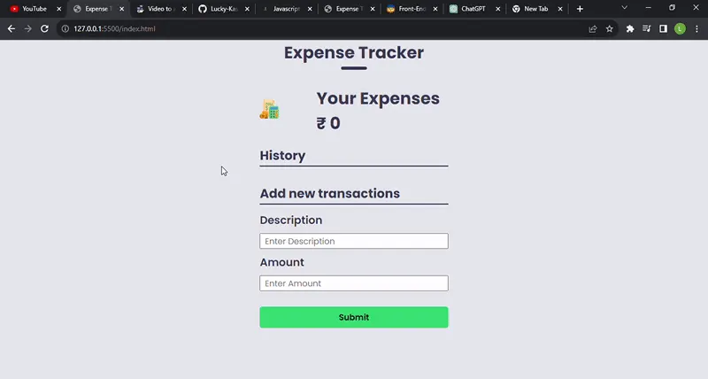
      <br />
      <strong>Expense Tracker</strong><br />
      <sub>Vanilla JS · Local state</sub>
    </td>
    <td align="center" width="50%">
      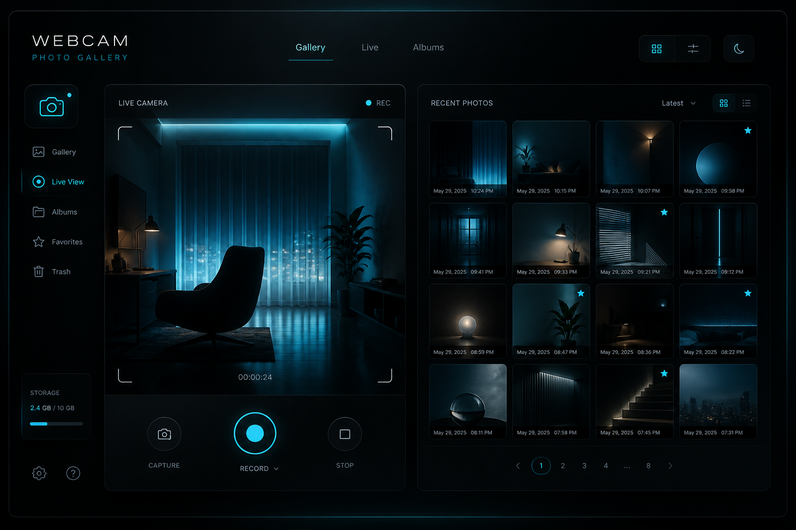
      <br />
      <strong>Webcam Gallery</strong><br />
      <sub>Vanilla JS · Media API</sub>
    </td>
  </tr>
  <tr>
    <td align="center" width="50%">
      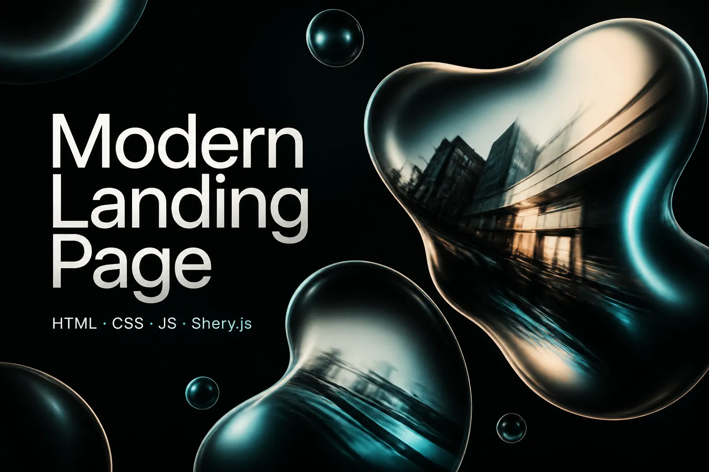
      <br />
      <strong>Shery.js Landing</strong><br />
      <sub>Animation · Modern UI</sub>
    </td>
    <td align="center" width="50%">
      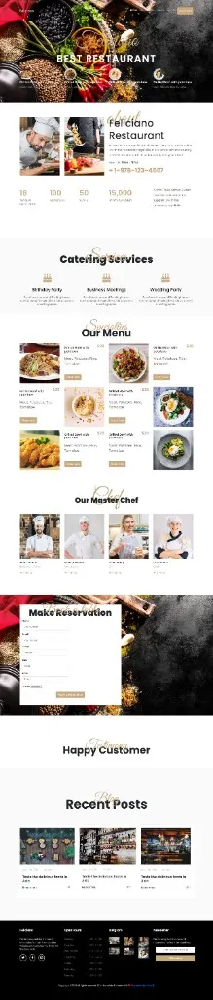
      <br />
      <strong>Feliciano Restaurant</strong><br />
      <sub>HTML · CSS · Homepage</sub>
    </td>
  </tr>
</table>

<details>
<summary><strong>Angular Mini E-commerce cover</strong></summary>

<p align="center">
  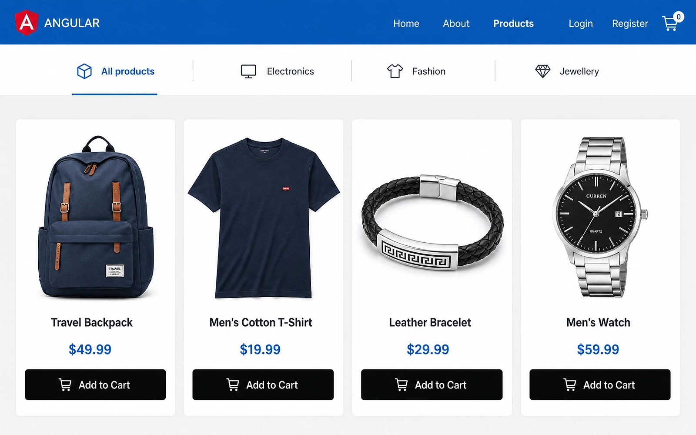
</p>

</details>

### Certifications

<p align="center">
  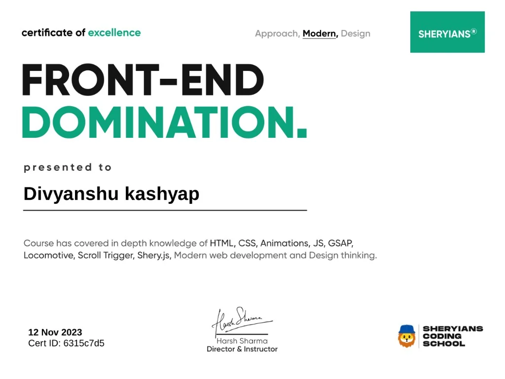
  &nbsp;
  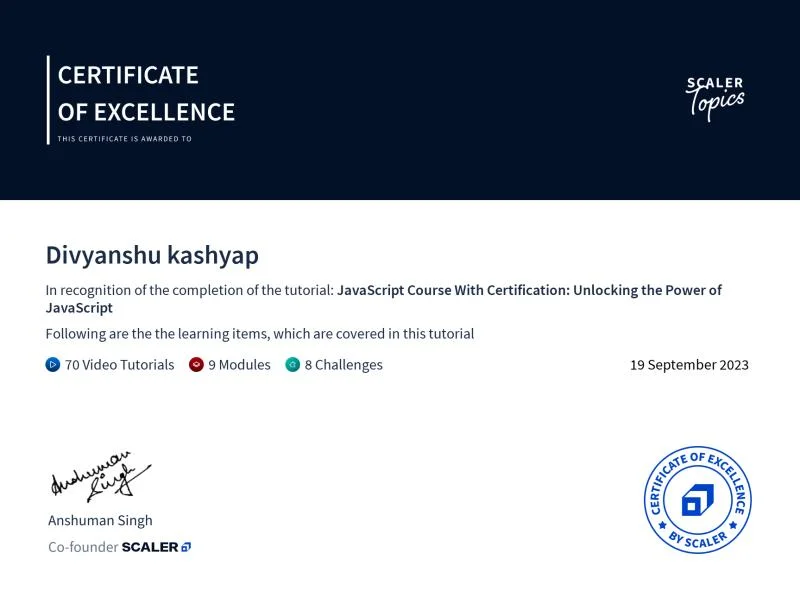
  &nbsp;
  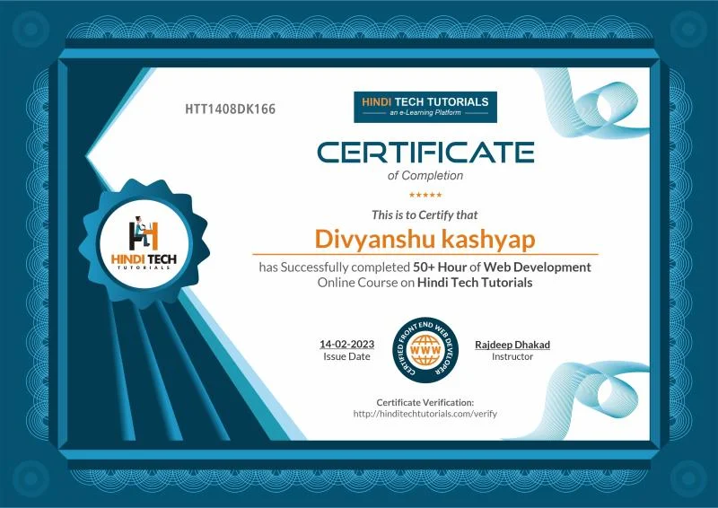
</p>

---

## Quick start

```bash
npm install
npm run dev
```

```bash
npm run build
npm start
```

Set production URL:

```bash
NEXT_PUBLIC_SITE_URL=https://your-domain.com
```

---

## Scripts

| Command | What it does |
| --- | --- |
| `npm run dev` | Local development server |
| `npm run build` | Production build |
| `npm start` | Serve production build |
| `npm run lint` | ESLint |
| `npm run media:posters` | Generate JPEG posters for `public/media/*.mp4` (needs `ffmpeg`) |

Re-encode + posters:

```bash
node scripts/generate-avatar-posters.mjs --encode
```

---

## Content & assets (one place)

| Path | Role |
| --- | --- |
| `lib/content.ts` | Copy, nav, projects, avatar media paths |
| `lib/seo.ts` | Title, description, OG, theme color |
| `public/media/hero-avatar.mp4` | Hero + About talking-head video |
| `public/media/hero-avatar-poster.jpg` | First paint / reduced-motion poster |
| `public/projects/**` | Project cover images |
| `public/profile/**` | Profile photo |
| `public/certificates/**` | Certificate images |
| `public/svgs/**` | Brand mark + favicon SVG |
| `public/contact/**` | Contact visual |

Drop a new avatar `.mp4` into `public/media/`, then run `npm run media:posters`.

Optional 3D character GLB (if you add one later): `public/models/avatar.glb` — wire via `lib/content.ts` only when needed. No separate README under `public/`.

---

## SEO & performance

- Meta / OG / Twitter: `app/layout.tsx` + `lib/seo.ts`
- JSON-LD: Person, WebSite, FAQPage (`components/seo/JsonLd.tsx`)
- `app/sitemap.ts` + `app/robots.ts`
- Prefer semantic HTML and accessible controls (FAQ, forms, focus rings)

---

## Design notes

- Dark navy surfaces with ice cyan (`#7dd3fc`) and soft amber accents
- Display type: **Syne** · Body: **DM Sans**
- Tokens: `tailwind.config.ts` · Global styles: `app/globals.css`

Do not add extra `README.md` files under `public/` — keep docs here.
